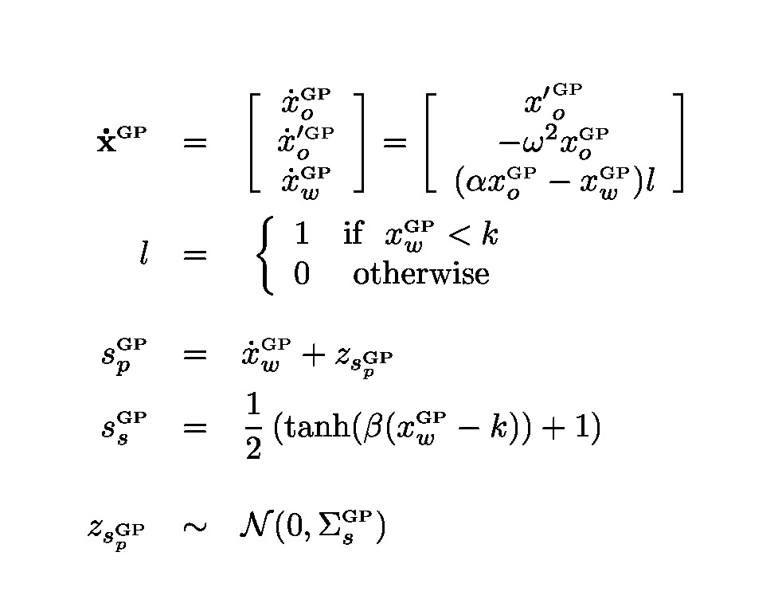
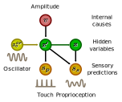
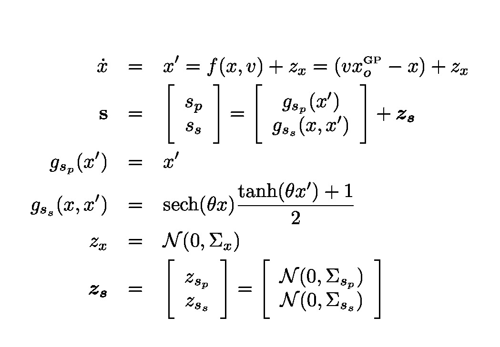
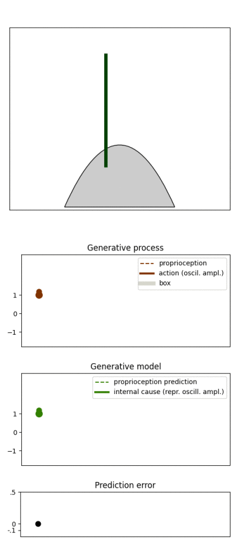
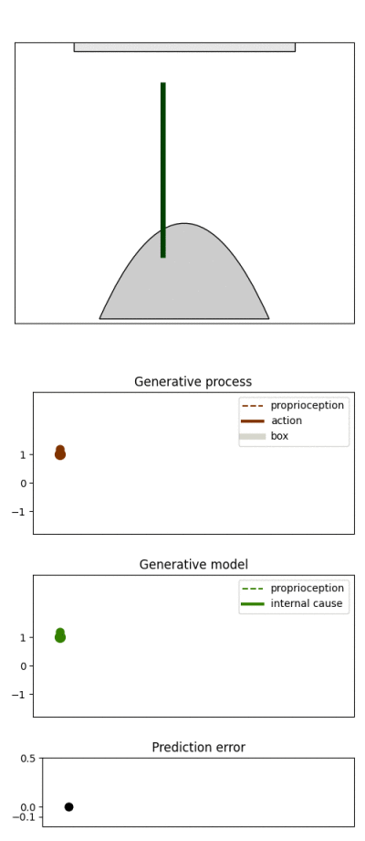

# Active Inference In Continuous Time With Whiskers

## Model description

**The generative process** defines a pattern generator for whisker's movemente. The amplitude of the pattern generator oscillations is modulated by a parameter α

 

**The generative model** gives predictions about touch events and changes in whisker position. the internl variable **x** models the scaled oscillator. The internal cause **v** defines the internal prior about the parameter α in the process.  The input from the oscillator itself stands for a prediction of this signal by a further internal variable with an infinitly precise conditional density.

## Demonstration of model behaviour
<ui style="list-style-position: outside">
<li >1 DoF: amplitude of oscillation </li>
<li> The generative model (green whisker / green line) predicts the whisker's movements </li>
<li> The generative process (black whisker / red line) defines actual  whisker's movements</li>
</ui>
<li> Prediction errors lead changes in the amplitude parameter in the process' oscillator and in the current prior about the desired amplitude in the model</li>
</ui>
<table>
  <tr height=100em>
    <td>
    
    </td>
    <td>
    
    </td>
    <td>
    
    </td>    
  </tr>

</table>
