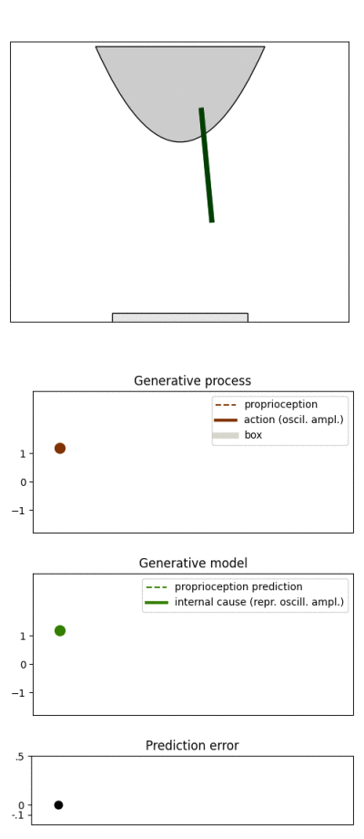

# Active Inference In Continuous Time With Whiskers

## Model description
<table>
<tr>
<td>

</td>
<td>

</td>
</tr>
</table>

## Demonstation of model behaviour
<table>
  <tr>
<td>
    </td>
    <td>
    </td>
    <td>
    </td>
  </tr>
</table>
